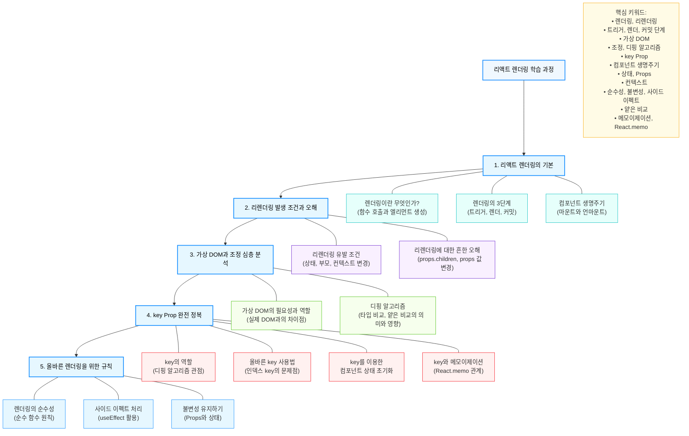

```mermaid
flowchart TD
    title["리액트 렌더링 학습 과정"]
    
    %% 메인 단계들
    step1["1. 리액트 렌더링의 기본"]
    step2["2. 리렌더링 발생 조건과 오해"]
    step3["3. 가상 DOM과 조정 심층 분석"]
    step4["4. key Prop 완전 정복"]
    step5["5. 올바른 렌더링을 위한 규칙"]
    
    %% 1단계 세부 항목
    step1_1["렌더링이란 무엇인가?
    (함수 호출과 엘리먼트 생성)"]
    step1_2["렌더링의 3단계
    (트리거, 렌더, 커밋)"]
    step1_3["컴포넌트 생명주기
    (마운트와 언마운트)"]
    
    %% 2단계 세부 항목
    step2_1["리렌더링 유발 조건
    (상태, 부모, 컨텍스트 변경)"]
    step2_2["리렌더링에 대한 흔한 오해
    (props.children, props 값 변경)"]
    
    %% 3단계 세부 항목
    step3_1["가상 DOM의 필요성과 역할
    (실제 DOM과의 차이점)"]
    step3_2["디핑 알고리즘
    (타입 비교, 얕은 비교의 의미와 영향)"]
    
    %% 4단계 세부 항목
    step4_1["key의 역할
    (디핑 알고리즘 관점)"]
    step4_2["올바른 key 사용법
    (인덱스 key의 문제점)"]
    step4_3["key를 이용한
    컴포넌트 상태 초기화"]
    step4_4["key와 메모이제이션
    (React.memo 관계)"]
    
    %% 5단계 세부 항목
    step5_1["렌더링의 순수성
    (순수 함수 원칙)"]
    step5_2["사이드 이펙트 처리
    (useEffect 활용)"]
    step5_3["불변성 유지하기
    (Props와 상태)"]
    
    %% 전체 흐름
    title --> step1
    step1 --> step2
    step2 --> step3
    step3 --> step4
    step4 --> step5
    
    %% 1단계 세부 연결
    step1 --- step1_1
    step1 --- step1_2
    step1 --- step1_3
    
    %% 2단계 세부 연결
    step2 --- step2_1
    step2 --- step2_2
    
    %% 3단계 세부 연결
    step3 --- step3_1
    step3 --- step3_2
    
    %% 4단계 세부 연결
    step4 --- step4_1
    step4 --- step4_2
    step4 --- step4_3
    step4 --- step4_4
    
    %% 5단계 세부 연결
    step5 --- step5_1
    step5 --- step5_2
    step5 --- step5_3
    
    %% 핵심 키워드 섹션
    keywords["핵심 키워드:
    • 렌더링, 리렌더링
    • 트리거, 렌더, 커밋 단계
    • 가상 DOM
    • 조정, 디핑 알고리즘
    • key Prop
    • 컴포넌트 생명주기
    • 상태, Props
    • 컨텍스트
    • 순수성, 불변성, 사이드 이펙트
    • 얕은 비교
    • 메모이제이션, React.memo"]
    
    %% 스타일링
    classDef default fill:#f9f9f9,stroke:#333,stroke-width:1px
    classDef titleClass fill:#f0f8ff,stroke:#1e90ff,stroke-width:2px,color:#000
    classDef mainStep fill:#e6f7ff,stroke:#1890ff,stroke-width:2px,color:#000
    classDef step1Class fill:#e6fffb,stroke:#13c2c2,stroke-width:1px
    classDef step2Class fill:#f9f0ff,stroke:#722ed1,stroke-width:1px
    classDef step3Class fill:#f6ffed,stroke:#52c41a,stroke-width:1px
    classDef step4Class fill:#fff1f0,stroke:#f5222d,stroke-width:1px
    classDef step5Class fill:#e6f7ff,stroke:#1890ff,stroke-width:1px
    classDef keywordsClass fill:#fffbe6,stroke:#faad14,stroke-width:1px
    
    class title titleClass
    class step1,step2,step3,step4,step5 mainStep
    class step1_1,step1_2,step1_3 step1Class
    class step2_1,step2_2 step2Class
    class step3_1,step3_2 step3Class
    class step4_1,step4_2,step4_3,step4_4 step4Class
    class step5_1,step5_2,step5_3 step5Class
    class keywords keywordsClass
```