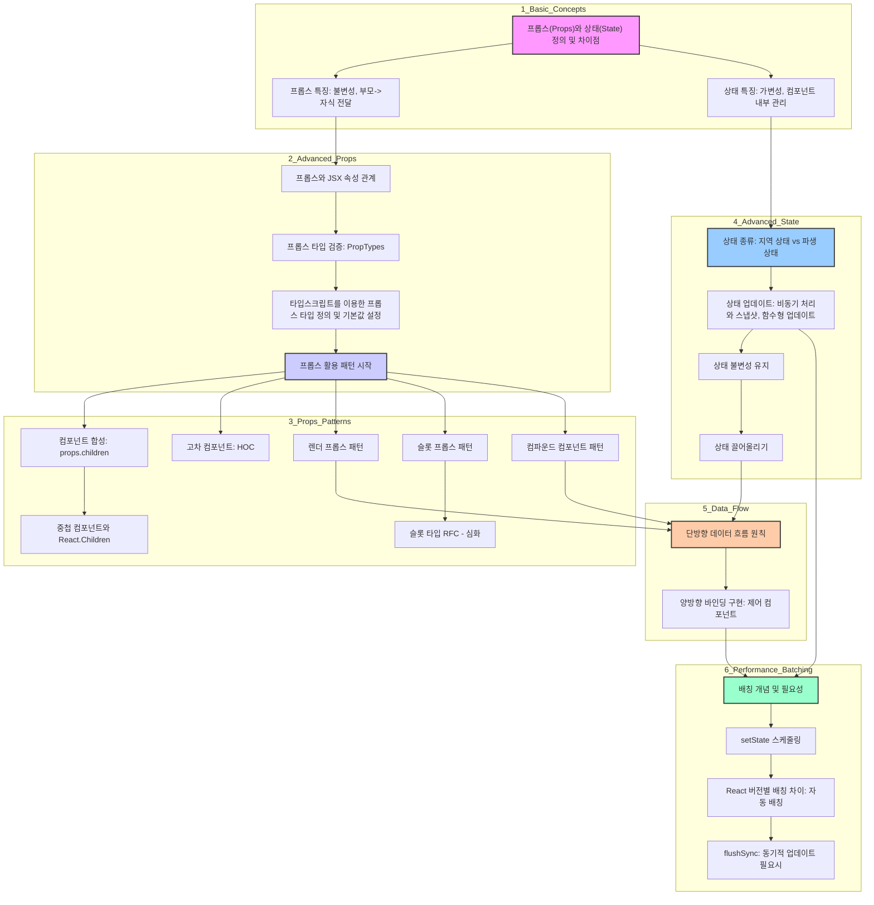

```mermaid
graph TD
    subgraph "1_Basic_Concepts"
        A["프롭스(Props)와 상태(State) 정의 및 차이점"] --> B["프롭스 특징: 불변성, 부모->자식 전달"]
        A --> C["상태 특징: 가변성, 컴포넌트 내부 관리"]
    end

    subgraph "2_Advanced_Props"
        B --> D["프롭스와 JSX 속성 관계"]
        D --> E["프롭스 타입 검증: PropTypes"]
        E --> F["타입스크립트를 이용한 프롭스 타입 정의 및 기본값 설정"]
        F --> G["프롭스 활용 패턴 시작"]
    end

    subgraph "3_Props_Patterns"
        G --> H["컴포넌트 합성: props.children"]
        H --> I["중첩 컴포넌트와 React.Children"]
        G --> J["고차 컴포넌트: HOC"]
        G --> K["렌더 프롭스 패턴"]
        G --> L["슬롯 프롭스 패턴"]
        L --> M["슬롯 타입 RFC - 심화"]
        G --> N["컴파운드 컴포넌트 패턴"]
    end

    subgraph "4_Advanced_State"
        C --> O["상태 종류: 지역 상태 vs 파생 상태"]
        O --> P["상태 업데이트: 비동기 처리와 스냅샷, 함수형 업데이트"]
        P --> Q["상태 불변성 유지"]
        Q --> R["상태 끌어올리기"]
    end

    subgraph "5_Data_Flow"
        R --> S["단방향 데이터 흐름 원칙"]
        N --> S
        K --> S
        S --> T["양방향 바인딩 구현: 제어 컴포넌트"]
    end

    subgraph "6_Performance_Batching"
        T --> U["배칭 개념 및 필요성"]
        P --> U
        U --> V["setState 스케줄링"]
        V --> W["React 버전별 배칭 차이: 자동 배칭"]
        W --> X["flushSync: 동기적 업데이트 필요시"]
    end

    classDef highlight fill:#f9f,stroke:#333,stroke-width:2px
    classDef patternNode fill:#ccf,stroke:#333,stroke-width:2px
    classDef stateNode fill:#9cf,stroke:#333,stroke-width:2px
    classDef flowNode fill:#fca,stroke:#333,stroke-width:2px
    classDef perfNode fill:#9fc,stroke:#333,stroke-width:2px
    
    class A highlight
    class G patternNode
    class O stateNode
    class S flowNode
    class U perfNode
```